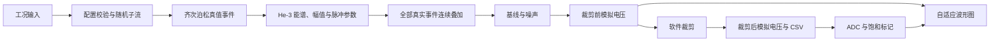

# He-3 连续脉冲信号模拟软件用户手册

## 1. 手册用途

本文档是软件功能、操作方法、物理原型、后端模块和数据格式的独立用户手册。
阶段人工审核步骤与审核记录另见 `docs/USER_MANUAL.md`。

当前软件用于：给定死时间之前的真实计数率、采样率、观察时间和随机种子，生成可复现的
He-3 热中子探测器前置放大器连续合成波形，并输出 HDF5、CSV、PNG、YAML 和 JSON。

当前参数尚未由真实探测器、前放、ADC 或示波器标定。输出适合算法开发、软件验证和合成数据研究，
不能直接作为某一台真实设备的定量预测。

## 2. 环境和启动

项目统一使用 `signal_create` Conda 环境。在 PowerShell 中执行：

```powershell
conda activate signal_create
Set-Location C:\Users\rosejuice\Desktop\he-3-signal\he3_codex_context
he3sim web
```

浏览器访问：

```text
http://127.0.0.1:8501
```

服务仅监听本机。若不自动打开浏览器：

```powershell
he3sim web --headless
```

若端口被占用：

```powershell
he3sim web --port 8502
```

在终端按 `Ctrl+C` 停止服务。

## 3. Web 输入参数

| 参数 | 单位 | 允许范围 | 含义 |
|---|---:|---:|---|
| 真实计数率 | cps | `10～1e7` | 死时间之前的齐次泊松真实事件到达率 |
| 采样率 | MS/s | `100～250` | 连续波形离散采样频率 |
| 观察时间 | ms | `0.001～动态最大值` | 本次连续波形时间窗 |
| 随机种子 | 无 | `0～2147483647` | 到达、能谱、幅值和噪声的复现入口 |

页面在每个输入框旁显示允许范围。观察时间最大值会随计数率和采样率自动更新，并同时受以下约束：

- 最多 5000000 个采样点；
- 最多 1000000 个预期事件。

采样点数量为：

$$
N_{\mathrm{sample}}=\left\lceil T f_s\right\rceil+1
$$

最大观察时间为：

$$
T_{\max}=\min\left(
\frac{N_{\max}-1}{f_s},
\frac{E_{\max}}{\lambda_{\mathrm{true}}}
\right)
$$

软件在采样点边界使用略小的可表示浮点数，避免舍入后多生成一个采样点。该限制是本地交互任务的
内存、HDF5、CSV 和绘图保护，不是探测器或采集设备的物理限制。

## 4. 生成操作

1. 输入真实计数率、采样率、观察时间和随机种子。
2. 查看页面给出的预期事件数、采样点数、采样间隔和原始数组内存估算。
3. 点击“生成连续波形”。
4. 等待页面显示实际事件数、渲染后端、三面板波形图和前 12 个采样点。
5. 下载 PNG、JSON 和小于 50 MiB 的 CSV，或直接访问页面显示的本地运行目录。

每次运行创建独立目录：

```text
outputs/web_runs/web-<UTC时间>-<随机后缀>/
├── run_config.yaml
├── waveform.h5
├── waveform.csv
├── waveform.png
└── sampling_info.json
```

## 5. 波形图说明

PNG 包含三个面板：

1. 全时间窗裁剪前模拟电压最小/最大包络；
2. 选定事件附近的裁剪前模拟电压细节；
3. 同一窗口的 ADC 码和饱和标记。

模拟电压和 ADC 纵轴按照当前可见数据自动缩放。密集窗口最多绘制 80 条代表性真值事件线和
500 个代表性饱和点，并显示附近事件总数、实际绘制标记数和饱和比例。

软件同时保存两种模拟电压：

- `preclip_analog_samples`：基线和噪声已加入、软件裁剪之前的连续电压；用于观察真实合成堆积形态；
- `analog_samples`：经过配置量程裁剪的连续电压；该数组进入 ADC 量化，也是 CSV 的电压来源。

在高计数率下，裁剪前电压可能明显超过演示配置的 `1.0 V` 上限。此时图的前两个面板仍能显示
裁剪前堆积波形，而 ADC 面板会正确显示饱和。这样可以同时区分“合成波形形态”和“量程不足”。

旧版本生成的 HDF5 不包含裁剪前数组，无法恢复已经丢弃的裁剪前幅值；必须重新生成波形。

## 6. 输出数据说明

### 6.1 HDF5 主文件

`waveform.h5` 是信息最完整的主文件：

```text
/metadata
/events/true
/blocks/preclip_analog_samples
/blocks/analog_samples
/blocks/adc_samples
/blocks/saturation_mask
/blocks/index
```

- `preclip_analog_samples`：裁剪前模拟电压，单位 V，`float32`；
- `analog_samples`：裁剪后模拟电压，单位 V，`float32`；
- `adc_samples`：量化后的无符号 ADC 码，`uint16`；
- `saturation_mask`：模拟裁剪或 ADC 越界标记；
- `events/true`：所有参与连续波形叠加的真值事件；
- `index`：分块偏移、长度、开始时间、采样率和事件数。

### 6.2 两列 CSV

`waveform.csv` 使用 UTF-8，严格只有两列：

```csv
time_s,voltage_V
0,0.000123
...
```

- `time_s`：第 `i` 个采样点的时间 `i/f_s`，单位秒；
- `voltage_V`：裁剪后的模拟电压，与 HDF5 `/blocks/analog_samples` 逐点一致。

CSV 以 65536 点分块写出。它不包含裁剪前电压、真值事件、ADC、饱和掩码或完整配置，不能替代 HDF5。

### 6.3 其他文件

| 文件 | 内容 |
|---|---|
| `run_config.yaml` | 本次实际配置、单位、状态和 seed |
| `waveform.png` | 裁剪前包络、事件细节、ADC 和饱和信息 |
| `sampling_info.json` | 输入、样本数、事件数、数据集路径、哈希和文件大小 |

## 7. 软件数据流程



Phase 3 数据集路径还会在 ADC 波形之后执行触发、死时间、真值关联和事件窗口。当前 Web 页面只调用
Phase 1～2 的真值事件到连续波形路径，尚未提供触发和死时间参数编辑。

## 8. 物理原型

### 8.1 齐次泊松事件到达

当前非相关热中子使用恒定真实到达率 `lambda_true` 的齐次泊松过程：

$$
N(T)\sim\operatorname{Poisson}(\lambda_{\mathrm{true}}T)
$$

相邻事件间隔：

$$
\Delta t_i\sim\operatorname{Exponential}(\lambda_{\mathrm{true}})
$$

软件保留两种精确算法：固定窗口主路径使用“泊松计数加排序均匀时刻”，交叉验证和流式扩展使用
“累积指数间隔”。随机数统一使用 `numpy.random.Generator` 和 `SeedSequence` 子流。

### 8.2 参数化 He-3 沉积能谱

物理原型来自：

$$
{}^3\mathrm{He}+n\rightarrow p+{}^3\mathrm{H}+764\ \mathrm{keV}
$$

能谱由 764 keV 全能峰、质子壁效应、氚壁效应和可选双壁效应组成。全能峰使用正值截断高斯，
壁效应使用有界 Beta 分布。混合权重非负且和为 1。这些是参数化演示分布，不是真实管体标定结果。

### 8.3 能量到峰值幅值

$$
A_{\mathrm{peak}}=G_EE_{\mathrm{dep}}+\epsilon_A
$$

`A_peak` 保存正的目标峰值幅度，脉冲正负由独立的 `polarity` 保存。当前增益、偏置和展宽参数均为
演示值。

### 8.4 峰值归一化双指数脉冲

令 `s=t-t_i`，当 `s>=0`：

$$
g(s)=e^{-s/\tau_d}-e^{-s/\tau_r},\qquad \tau_d>\tau_r>0
$$

$$
t_{\mathrm{peak}}=
\frac{\tau_r\tau_d}{\tau_d-\tau_r}
\ln\left(\frac{\tau_d}{\tau_r}\right)
$$

$$
v_i(t)=\mathrm{polarity}_i\,A_{\mathrm{peak},i}
\frac{g(t-t_i)}{g(t_{\mathrm{peak}})}
$$

离散实现按事件相对采样网格的分数相位校正峰值，使孤立脉冲在离散波形上的峰值保持为
配置的 `A_peak`。

### 8.5 连续波形和堆积

$$
v(t)=b(t)+n(t)+\sum_i v_i(t)
$$

所有真实事件都参与求和，因此高计数率自然产生堆积。`direct_sparse` 是逐事件参考实现；
`recursive_fixed_tau` 使用两个指数递推状态实现高效固定时间常数波形，并保持跨块尾部连续；
`auto` 自动选择后端。

### 8.6 基线、噪声、裁剪和 ADC

当前支持常量基线、高斯白噪声、可选 AR(1) 低频漂移、模拟电压裁剪、ADC 输入范围与位数量化，
以及每点饱和标记。处理顺序为：

```text
脉冲叠加 → 基线/噪声 → 保存裁剪前电压 → 模拟裁剪 → 保存裁剪后电压 → ADC
```

简单裁剪不是空间电荷、气体增益变化或真实前放饱和恢复模型。真实恢复行为必须等待示波器数据标定。

### 8.7 触发与死时间

Phase 3 数据集支持 `none`、`nonparalyzable` 和 `paralyzable`：

$$
m_{\mathrm{nonparalyzable}}=\frac{\lambda}{1+\lambda\tau_d}
$$

$$
m_{\mathrm{paralyzable}}=\lambda e^{-\lambda\tau_d}
$$

死时间只改变观测候选的接受状态，不能删除真值事件或它们的连续波形贡献。

## 9. 后端模块对应表

| 模块 | 职责 | 物理/工程原型 |
|---|---|---|
| `he3sim/config.py` | 配置、范围、单位和参数状态 | 工况与可追溯合同 |
| `he3sim/random.py` | seed 和独立随机子流 | 可复现随机过程 |
| `physics/rate_profiles.py` | 恒定计数率接口 | `lambda_true` 工况 |
| `physics/arrivals.py` | 两种泊松到达算法 | 齐次泊松点过程 |
| `physics/spectra.py` | 全能峰和壁效应混合 | 参数化 He-3 能谱 |
| `physics/amplitude.py` | 能量到正峰值 | 线性增益与幅值展宽 |
| `physics/pulse_models.py` | 双指数核和峰值校正 | 前放单脉冲响应原型 |
| `physics/pulse_parameters.py` | 每事件时间常数 | 脉冲形状参数提供器 |
| `physics/events.py` | 组合真值事件字段 | 到达、能量、幅值和形状 |
| `physics/event_stream.py` | 按时间块生成真值 | 高计数率流式点过程 |
| `synthesis/renderers.py` | 参考和递推叠加 | 线性响应与堆积 |
| `synthesis/streaming.py` | 分块连续波形、裁剪前后数组 | 跨块电子学状态 |
| `synthesis/baseline.py` | 常量基线 | 前放零点原型 |
| `synthesis/noise.py` | 白噪声和 AR(1) 漂移 | 电子噪声与慢漂移 |
| `synthesis/digitizer.py` | 裁剪、ADC 和饱和标记 | 模拟量程与数字化 |
| `acquisition/trigger.py` | 阈值、滞回和保持时间 | 软件触发器 |
| `acquisition/dead_time.py` | 三种死时间模式 | 观测层计数损失 |
| `acquisition/event_matching.py` | 触发与真值关联 | 堆积可追溯关系 |
| `synthesis/dataset.py` | 连续区和事件窗口 | 多尺度数据集 |
| `io/hdf5.py`、`io/dataset.py` | 分块压缩持久化 | 科研主数据格式 |
| `analysis/waveform_plot.py` | 裁剪前波形、自适应纵轴和饱和图 | 人工波形审核 |
| `analysis/counting_stats.py` | 到达统计验证 | 均值、Fano 和间隔分布 |
| `analysis/phase3_validation.py` | 死时间扫描和内存报告 | 解析计数关系 |
| `analysis/pulse_features.py` | 上升、下降和积分 | 离散脉冲特征 |
| `app/web_backend.py` | 资源预检、生成、CSV/JSON | Web 与物理核心边界 |
| `app/streamlit_app.py` | 输入范围、预估、图片和下载 | 本地交互控制层 |
| `he3sim/cli.py` | 统一命令入口 | 可脚本化工作流 |

## 10. 命令行功能

```powershell
he3sim validate-config -c configs/demo_minimal.yaml
he3sim simulate-events -c configs/demo_minimal.yaml -o outputs/events.h5
he3sim validate-arrivals -c configs/demo_minimal.yaml -o outputs/arrival_validation
he3sim simulate-waveform -c configs/demo_minimal.yaml -o outputs/waveform.h5
he3sim plot-waveform outputs/waveform.h5 -o outputs/waveform.png
he3sim generate-dataset -c configs/demo_minimal.yaml -o outputs/dataset
he3sim validate-physics -c configs/demo_minimal.yaml -o outputs/physics_validation
he3sim inspect outputs/waveform.h5
```

## 11. 常见问题

### 11.1 高计数率图片仍是一条平线

确认该文件是否由当前版本重新生成，并检查 HDF5 是否包含：

```text
/blocks/preclip_analog_samples
```

旧文件只有裁剪后数组，无法恢复裁剪前波形。新文件的前两个 PNG 面板应显示裁剪前连续波形；
ADC 面板仍可能完全饱和，这是量程结果而不是绘图失败。

### 11.2 观察时间不能继续增大

页面最大值取采样点和预期事件两类上限的较小值。可降低采样率、降低计数率或缩短观察时间。
更长统计视界应使用 Phase 3 多尺度数据集路径，而不是一次渲染超大连续数组。

### 11.3 CSV 与图片电压不同

CSV 保存裁剪后模拟电压；PNG 前两个面板优先显示裁剪前模拟电压。ADC 也由裁剪后电压产生。
需要比较时，应分别读取 HDF5 的两个模拟电压数据集。

### 11.4 相同输入得到不同结果

确认随机种子、四个 Web 输入、基础配置和代码版本完全一致。每次运行目录名不同不会改变核心随机数组。

## 12. 条件标记事件网络 A

### 12.1 定位

网络 A 是精确物理事件生成器的研究对照，不是默认生成器。Phase 4 实测标定当前按用户要求推迟，
因此网络只学习 `synthetic_demo` 的齐次泊松到达和参数化 marks。PyTorch 是 `.[ml]` 可选依赖，
仅由 `he3sim.ml` 使用；`he3sim.physics` 物理核心不依赖 PyTorch。

### 12.2 输入和输出

模型条件包含：

- `log10(true_rate_cps)`；
- 窗口时长与预期事件规模；
- 从基础配置派生的能谱、幅值和时间常数编码；
- 由显式 seed 控制的随机潜变量。

输出沿用真值事件表字段：时间、能量、能谱类型、峰值幅值、`tau_r`、`tau_d`、极性和参数状态。
事件数量可变，时间严格递增。类型和能量受配置支持域约束；幅值和时间常数通过正值密度生成，
始终满足 `tau_d > tau_r > 0`。

### 12.3 模型原理

- 事件数：Poisson 似然头，在已知 `rate × duration` 周围学习有界残差；
- 时间间隔：正值指数混合似然头；推理抽取 `N+1` 个间隔并归一化到窗口；
- 事件类型：categorical likelihood，屏蔽配置中零权重成分；
- 能量：按类型支持域上的 logistic-normal likelihood；
- 幅值与时间常数：条件 log-normal likelihood；
- 总损失：各头负对数似然之和，不使用 MSE 代替分布训练。

### 12.4 训练和比较

从仓库外层目录启动时，先进入实际 Python 项目根目录；如果已经位于 `he3_codex_context`，跳过
第二行。命令必须逐行运行：

```powershell
Set-Location .\he3_codex_context
conda run -n signal_create python -c "import sys; print(sys.executable)"
conda run -n signal_create python -m he3sim train-event-model -c configs/ml_event.yaml
conda run -n signal_create python -m he3sim compare-event-model -c configs/ml_event_eval.yaml -o outputs/phase05_comparison
```

Python 路径必须包含 `envs\signal_create`。`conda run` 不依赖当前提示符是否仍显示 `(base)`；使用环境内的
`python -m he3sim` 可避免误调用 base 环境中的全局 `he3sim.exe`。当前统一环境已经安装 ML 依赖；
仅在新环境中才需要执行 `conda run -n signal_create python -m pip install -e ".[ml]"`。
不要用 PowerShell 反引号把多条审核命令连在一起。

训练配置支持 `device: cpu`、`device: cuda` 和 `device: auto`。显式选择 CUDA 但不可用时会直接报错。
checkpoint 可恢复优化器和 epoch；基础配置哈希不一致时拒绝恢复。

比较覆盖 13 个标准计数率与 12 个未直接训练的几何中点，评价计数率偏差、Fano factor、间隔 KS、
间隔自相关、事件类型、能量/幅值/时间常数边缘、能量-幅值相关、非法输出、速度、内存和显存。

当前 RTX 5060 Laptop GPU 结果中 25/25 工况通过统计门槛且无非法事件，但本次人工审核命令复验的
网络吞吐率仅为精确基线约 0.071 倍。因此模型卡固定为 `experimental`，比较报告固定
`promotion_recommended=false`，现有物理、波形、数据集和 Web 路径均不调用网络 A。

### 12.5 产物

| 路径 | 内容 |
|---|---|
| `outputs/phase05_training/checkpoint_latest.pt` | 最新权重、优化器、epoch、架构与哈希 |
| `outputs/phase05_training/MODEL_CARD.md` | 用途、约束、状态与限制 |
| `outputs/phase05_training/training_summary.json` | loss、设备、耗时和显存 |
| `outputs/phase05_comparison/phase05_comparison.md` | 人工可读比较结论 |
| `outputs/phase05_comparison/phase05_comparison.json` | 完整机器可读指标 |
| `outputs/phase05_comparison/phase05_rate_metrics.csv` | 每个计数率的指标行 |

## 13. 当前限制

- 仅模拟恒定计数率、非相关热中子的齐次泊松过程；
- 能谱、增益、时间常数、噪声、量程和 ADC 尚未真实标定；
- 没有空间电荷、气体增益随计数率变化、前放非线性恢复或真实饱和恢复；
- Web 页面暂不编辑能谱、脉冲、噪声、ADC、触发和死时间参数；
- 不包含示波器导入、真实标定、MCNP 自动运行或硬件控制；
- 网络 A 已作为独立 experimental 研究工具实现，但未接入默认生成链；网络 C 尚未实现。

完整数学合同见 `docs/model_spec.md`，项目范围与阶段门禁见 `docs/PROJECT_SPEC.md`。
